# SaaS Kit Monorepo Architecture Documentation

A comprehensive guide to understanding and working with this pnpm-based monorepo designed for building full-stack SaaS applications on Cloudflare's edge platform.

---

## High-Level Architecture Overview

```mermaid
graph TB
    subgraph "Monorepo Root"
        ROOT["📦 saas-kit/"]
    end
    
    subgraph "Applications"
        UA["🖥️ user-application<br/>(TanStack Start + React)"]
        DS["⚙️ data-service<br/>(RPC Service + Durable Objects)"]
    end
    
    subgraph "Shared Packages"
        DO["📚 @repo/data-ops<br/>(Auth, Database, Schemas)"]
    end
    
    subgraph "Cloudflare Platform"
        D1[("🗄️ D1 Database")]
        DurObj["💾 Durable Objects"]
        Workflows["🔄 Workflows"]
        SB["🔗 Service Bindings (RPC)"]
    end
    
    ROOT --> UA
    ROOT --> DS
    ROOT --> DO
    
    UA -->|"workspace:^"| DO
    DS -->|"workspace:*"| DO
    
    UA -->|"RPC calls"| SB
    SB --> DS
    
    UA --> D1
    DS --> D1
    DS --> DurObj
    DS --> Workflows
```



---

## Core Architectural Principle

> [!IMPORTANT]
> **RPC-First Architecture**: Communication between `user-application` and `data-service` uses Cloudflare Service Bindings (type-safe RPC), not HTTP APIs. This provides zero-latency, fully typed inter-service calls.

### Why RPC Over HTTP?

| Aspect | HTTP API | RPC (Service Bindings) |
|--------|----------|------------------------|
| **Latency** | HTTP parsing overhead | Zero overhead, direct calls |
| **Type Safety** | Manual types/codegen | Full TypeScript inference |
| **Developer Experience** | Define routes, handlers, clients | Just call methods |
| **Maintenance** | Two surfaces (server + client) | One interface |

---

## Directory Structure

```
saas-kit/
├── apps/
│   ├── user-application/     # Frontend React app (TanStack Start)
│   │   ├── src/
│   │   │   ├── routes/       # File-based TanStack Router routes
│   │   │   ├── components/   # React UI components
│   │   │   ├── core/         # Server functions & middleware
│   │   │   ├── integrations/ # Third-party integrations
│   │   │   ├── lib/          # Utilities (auth client, etc.)
│   │   │   └── server.ts     # Custom Cloudflare Worker entry
│   │   ├── wrangler.jsonc    # Cloudflare config
│   │   └── vite.config.ts    # Vite + TanStack build config
│   │
│   └── data-service/         # Backend RPC Service
│       ├── src/
│       │   ├── index.ts      # WorkerEntrypoint with RPC methods
│       │   ├── hono/         # WebSocket routing only
│       │   ├── durable-objects/
│       │   └── workflows/
│       └── wrangler.jsonc    # Cloudflare config
│
├── packages/
│   └── data-ops/             # Shared data operations package
│       ├── src/
│       │   ├── auth/         # better-auth setup
│       │   ├── database/     # Drizzle ORM setup
│       │   ├── drizzle/      # Schema & migrations
│       │   ├── queries/      # Shared database queries
│       │   └── zod-schema/   # Validation schemas
│       └── drizzle.config.ts
│
├── package.json              # Root workspace scripts
└── pnpm-workspace.yaml       # Workspace configuration
```

---

## Package Manager & Workspace Configuration

### pnpm Workspaces

The monorepo uses **pnpm workspaces** for efficient dependency management and package linking.

**[pnpm-workspace.yaml](file:///Users/optimaliste/Documents/Code/CloudFlare/saas-kit/pnpm-workspace.yaml)**:
```yaml
packages:
  - "packages/*"
  - "apps/*"

onlyBuiltDependencies:
  - '@tailwindcss/oxide'
  - better-sqlite3
  - esbuild
  - sharp
  - workerd
```

### Root Scripts

**[package.json](file:///Users/optimaliste/Documents/Code/CloudFlare/saas-kit/package.json)** provides unified commands:

| Command | Description |
|---------|-------------|
| `pnpm run setup` | Install deps + build data-ops package |
| `pnpm run build:data-ops` | Build the shared package |
| `pnpm run dev:user-application` | Start frontend dev server |
| `pnpm run dev:data-service` | Start backend dev server |
| `pnpm run deploy:user-application` | Build & deploy frontend |
| `pnpm run deploy:data-service` | Build & deploy backend |

> [!IMPORTANT]
> **Build Order Matters**: The `data-ops` package must be built before running or deploying either app. This is why deploy scripts include `pnpm run build:data-ops` first.

---

## The Shared Package: `@repo/data-ops`

This package centralizes all data-related logic that's shared between the frontend and backend.

### Package Exports

**[packages/data-ops/package.json](file:///Users/optimaliste/Documents/Code/CloudFlare/saas-kit/packages/data-ops/package.json)** uses subpath exports:

```json
{
  "exports": {
    "./auth/*": {
      "default": "./dist/src/auth/*.js",
      "types": "./dist/src/auth/*.d.ts"
    },
    "./database/*": {
      "default": "./dist/src/database/*.js",
      "types": "./dist/src/database/*.d.ts"
    },
    "./zod-schema/*": {
      "default": "./dist/src/zod-schema/*.js",
      "types": "./dist/src/zod-schema/*.d.ts"
    },
    "./queries/*": {
      "default": "./dist/src/queries/*.js",
      "types": "./dist/src/queries/*.d.ts"
    }
  }
}
```

### Consuming the Package

```typescript
// In apps - import specific modules
import { setAuth, getAuth } from "@repo/data-ops/auth/server";
import { initDatabase } from "@repo/data-ops/database/setup";
import { exampleSchema } from "@repo/data-ops/zod-schema/example";
```

### Build Process

The package builds with TypeScript and uses `tsc-alias` for path resolution:

```bash
pnpm run build  # Runs: tsc -p tsconfig.json --outDir ./dist && tsc-alias
```

---

## Application Architecture

### User Application (Frontend)

A **TanStack Start** application - a full-stack React framework running on Cloudflare Workers.


#### Key Concepts

**1. Custom Server Entry** ([src/server.ts](file:///Users/optimaliste/Documents/Code/CloudFlare/saas-kit/apps/user-application/src/server.ts))

```typescript
import { setAuth } from "@repo/data-ops/auth/server";
import { initDatabase } from "@repo/data-ops/database/setup";
import handler from "@tanstack/react-start/server-entry";
import { env } from "cloudflare:workers";

export default {
  fetch(request: Request) {
    // Initialize database with Cloudflare D1 binding
    const db = initDatabase(env.DB);
    
    // Configure auth with environment secrets
    setAuth({
      secret: env.BETTER_AUTH_SECRET,
      socialProviders: { google: { ... } },
      adapter: { drizzleDb: db, provider: "sqlite" },
    });
    
    return handler.fetch(request, { context: { fromFetch: true } });
  },
};
```

**2. File-Based Routing** (`src/routes/`)

| Route File | URL Path | Purpose |
|------------|----------|---------|
| `__root.tsx` | Layout | Root layout with providers |
| `index.tsx` | `/` | Landing page |
| `_auth/route.tsx` | Protected layout | Auth-gated routes |
| `_auth/app/index.tsx` | `/app` | Main app dashboard |
| `api/auth.$.tsx` | `/api/auth/*` | Auth API routes |

**3. Server Functions & Middleware**

```typescript
// core/middleware/auth.ts - Protected route middleware
export const protectedFunctionMiddleware = createMiddleware({
  type: "function",
}).server(async ({ next }) => {
  const auth = getAuth();
  const session = await auth.api.getSession(getRequest());
  if (!session) throw new Error("Unauthorized");
  return next({ context: { userId: session.user.id } });
});

// core/functions/example-functions.ts - Server function calling backend via RPC
export const examplefunction = createServerFn()
  .middleware([exampleMiddlewareWithContext])
  .inputValidator((data) => ExampleInputSchema.parse(data))
  .handler(async (ctx) => {
    // Type-safe RPC call to data-service
    await env.BACKEND_SERVICE.saveData(ctx.data.exampleKey);
    const result = await env.BACKEND_SERVICE.getData();
    return result;
  });
```

---

### Data Service (Backend)

A **Cloudflare Worker** exposing **RPC methods** via `WorkerEntrypoint`, with **Hono for WebSocket routing only**.


#### The Separation of Concerns

> [!TIP]
> **Hono = Transport** (WebSocket upgrades, external webhooks)
> **RPC Methods = Business Logic** (data operations, Durable Object interactions)

#### Worker Entry Point

**[src/index.ts](file:///Users/optimaliste/Documents/Code/CloudFlare/saas-kit/apps/data-service/src/index.ts)**:

```typescript
import { WorkerEntrypoint } from "cloudflare:workers";
import { app } from "@/hono/app";

export { ExampleDurableObject } from "@/durable-objects/example-durable-object";

export default class DataService extends WorkerEntrypoint<Env> {
  // HTTP handler - WebSockets and webhooks only
  fetch(request: Request) {
    return app.fetch(request, this.env, this.ctx);
  }

  // ─────────────────────────────────────────────
  // RPC METHODS - Called via service bindings
  // These are your type-safe API to this service
  // ─────────────────────────────────────────────

  async saveData(data: string) {
    const doId = this.env.EXAMPLE_DURABLE_OBJECT.idFromName("example");
    const stub = this.env.EXAMPLE_DURABLE_OBJECT.get(doId);
    return await stub.saveData(data);
  }

  async getData() {
    const doId = this.env.EXAMPLE_DURABLE_OBJECT.idFromName("example");
    const stub = this.env.EXAMPLE_DURABLE_OBJECT.get(doId);
    return await stub.getData();
  }

  // Add more RPC methods as needed...
  async createRoom(name: string) { /* ... */ }
  async processPayment(amount: number) { /* ... */ }
}
```

#### Hono Routes (WebSocket & Webhooks Only)

**[src/hono/app.ts](file:///Users/optimaliste/Documents/Code/CloudFlare/saas-kit/apps/data-service/src/hono/app.ts)**:

```typescript
import { Hono } from "hono";
import { upgradeWebSocket } from "hono/cloudflare-workers";

export const app = new Hono<{ Bindings: Env }>();

// ─────────────────────────────────────────────
// WEBSOCKET ROUTES - Real-time connections
// ─────────────────────────────────────────────

// Direct WebSocket handling
app.get("/ws", upgradeWebSocket((c) => ({
  onOpen(evt, ws) {
    console.log("WebSocket opened");
  },
  onMessage(evt, ws) {
    ws.send(`Echo: ${evt.data}`);
  },
  onClose() {
    console.log("WebSocket closed");
  },
})));

// WebSocket via Durable Object (recommended for rooms/sessions)
app.get("/ws/room/:roomId", async (c) => {
  const roomId = c.req.param("roomId");
  const id = c.env.ROOM_DO.idFromName(roomId);
  return c.env.ROOM_DO.get(id).fetch(c.req.raw);
});

// ─────────────────────────────────────────────
// WEBHOOK ROUTES - External service callbacks
// ─────────────────────────────────────────────

app.post("/webhooks/stripe", async (c) => {
  // Verify Stripe signature, process event
  return c.json({ received: true });
});

app.post("/webhooks/polar", async (c) => {
  // Handle Polar payment webhooks
  return c.json({ received: true });
});

// ─────────────────────────────────────────────
// NO BUSINESS LOGIC HERE!
// Use RPC methods in the WorkerEntrypoint class
// ─────────────────────────────────────────────
```

---

## Cloudflare Bindings & Communication

### Service Bindings (RPC)

The `user-application` communicates with `data-service` via Cloudflare Service Bindings — type-safe RPC, not HTTP.

**Frontend wrangler.jsonc**:
```jsonc
{
  "services": [{
    "binding": "BACKEND_SERVICE",
    "service": "saas-kit-data-service-stage",
    "remote": true
  }]
}
```

**Usage in frontend server functions**:
```typescript
import { env } from "cloudflare:workers";

// Direct RPC call - no HTTP overhead, full type safety!
const data = await env.BACKEND_SERVICE.getData();
await env.BACKEND_SERVICE.saveData("new-value");
await env.BACKEND_SERVICE.createRoom("my-room");
```

### WebSocket Flow

For real-time features, WebSocket requests flow through HTTP:


**In user-application server.ts** (if proxying WS):
```typescript
export default {
  async fetch(request: Request) {
    const url = new URL(request.url);
    
    // Forward WebSocket requests to data-service
    if (url.pathname.startsWith("/ws")) {
      return env.BACKEND_SERVICE.fetch(request);
    }
    
    // Normal requests
    return handler.fetch(request, { context: { fromFetch: true } });
  },
};
```

### D1 Database

Both apps share the same D1 database instance:

```jsonc
"d1_databases": [{
  "binding": "DB",
  "database_id": "bccc5633-a7e4-4b66-a01a-f09c6298c323",
  "remote": true
}]
```

### Environment Structure


---

## Database Layer (Drizzle ORM)

### Schema Definition

**[packages/data-ops/src/drizzle/auth-schema.ts](file:///Users/optimaliste/Documents/Code/CloudFlare/saas-kit/packages/data-ops/src/drizzle/auth-schema.ts)**:

```typescript
import { sqliteTable, text, integer } from "drizzle-orm/sqlite-core";

export const auth_user = sqliteTable("auth_user", {
  id: text("id").primaryKey(),
  name: text("name").notNull(),
  email: text("email").notNull().unique(),
  emailVerified: integer("email_verified", { mode: "boolean" }),
  // ...
});

export const auth_session = sqliteTable("auth_session", {
  id: text("id").primaryKey(),
  userId: text("user_id").references(() => auth_user.id, { onDelete: "cascade" }),
  // ...
});
```

### Migration Workflow

```bash
# Generate auth schema from better-auth
pnpm run better-auth:generate

# Generate Drizzle migrations
pnpm run drizzle:generate

# Apply migrations to D1
pnpm run drizzle:migrate
```

---

## Authentication Flow

The auth system uses **better-auth** with the Drizzle adapter, running on the edge.


### Auth API Route

**[src/routes/api/auth.$.tsx](file:///Users/optimaliste/Documents/Code/CloudFlare/saas-kit/apps/user-application/src/routes/api/auth.%24.tsx)**:

```typescript
export const Route = createFileRoute("/api/auth/$")({
  server: {
    handlers: {
      GET: ({ request }) => getAuth().handler(request),
      POST: ({ request }) => getAuth().handler(request),
    },
  },
});
```

### Client-Side Auth

**[src/lib/auth-client.ts](file:///Users/optimaliste/Documents/Code/CloudFlare/saas-kit/apps/user-application/src/lib/auth-client.ts)**:

```typescript
import { createAuthClient } from "better-auth/react";

export const authClient = createAuthClient();
export const { useSession, signIn, signOut } = authClient;
```

---

## Development Workflow

### Getting Started

```bash
# 1. Install all dependencies
pnpm install

# 2. Build shared package
pnpm run build:data-ops

# 3. Generate Cloudflare types (in each app)
cd apps/user-application && pnpm run cf-typegen
cd apps/data-service && pnpm run cf-typegen

# 4. Start development
pnpm run dev:user-application  # Frontend on port 3000
pnpm run dev:data-service      # Backend worker
```

### Adding New Features

````carousel
**Adding a new RPC method**:
```typescript
// data-service/src/index.ts
export default class DataService extends WorkerEntrypoint<Env> {
  // Add your new method
  async processOrder(orderId: string, items: string[]) {
    // Business logic here
    return { success: true, orderId };
  }
}

// user-application - call it with full type safety
const result = await env.BACKEND_SERVICE.processOrder("123", ["item1"]);
```
<!-- slide -->
**Adding a WebSocket room**:
```typescript
// data-service/src/hono/app.ts
app.get("/ws/chat/:roomId", async (c) => {
  const roomId = c.req.param("roomId");
  const id = c.env.CHAT_ROOM_DO.idFromName(roomId);
  return c.env.CHAT_ROOM_DO.get(id).fetch(c.req.raw);
});

// Create ChatRoomDO in durable-objects/
```
<!-- slide -->
**Adding a new shared schema**:
```bash
# 1. Create schema in packages/data-ops/src/zod-schema/
# 2. Export from the module
# 3. Rebuild: pnpm run build:data-ops
# 4. Import in apps: import { newSchema } from "@repo/data-ops/zod-schema/new"
```
<!-- slide -->
**Adding a new server function**:
```typescript
// apps/user-application/src/core/functions/new-function.ts
export const newFunction = createServerFn()
  .middleware([protectedFunctionMiddleware])
  .inputValidator((data) => schema.parse(data))
  .handler(async (ctx) => {
    // Call backend via RPC
    return await env.BACKEND_SERVICE.myMethod(ctx.data);
  });
```
````

---

## Key Architectural Decisions

### Why This Structure?

| Decision | Rationale |
|----------|-----------|
| **RPC over HTTP** | Zero latency, type-safe, simpler DX |
| **Hono for transport only** | WebSockets need HTTP upgrade; keep it minimal |
| **Shared data-ops package** | Single source of truth for schemas, auth, DB setup |
| **pnpm workspaces** | Efficient disk space, strict dependency isolation |
| **D1 + Drizzle** | SQLite at the edge with type-safe queries |
| **TanStack Start** | Full-stack React with SSR on Workers |
| **better-auth** | Modern, extensible auth that works on the edge |

### The RPC Discipline Rule

> [!CAUTION]
> **Keep Hono routes minimal!** Only use HTTP routes for:
> - WebSocket upgrades
> - External webhooks (Stripe, Polar, etc.)
> - Health checks
> 
> **All business logic goes in RPC methods.** This prevents duplication and keeps the architecture clean.

### Future: Need a Public API?

When you need an API for mobile apps or third parties, **create a separate app**:

```
apps/
├── user-application/   # Web frontend (RPC to data-service)
├── data-service/       # RPC service (business logic, DOs)
└── api/                # Public REST API (NEW)
    ├── src/
    │   └── index.ts    # Hono app with full routing
    └── wrangler.jsonc
```

The `api` app would:
- Use Hono for RESTful routes
- Handle API key authentication
- Implement rate limiting
- Version endpoints (`/v1/users`)
- Call `@repo/data-ops` or `data-service` via service binding

This keeps concerns separated: internal RPC vs external HTTP API.

---

## Common Patterns

### Protected Routes

```typescript
// Use layout routes for auth-gated sections
// _auth/route.tsx wraps all child routes with auth check
const session = authClient.useSession();
return session.data ? <Outlet /> : <Login />;
```

### Server-to-Backend Communication (RPC)

```typescript
// From user-application server functions
import { env } from "cloudflare:workers";

// Type-safe RPC call - this is the primary pattern
const result = await env.BACKEND_SERVICE.saveData(data);
const user = await env.BACKEND_SERVICE.getUserProfile(userId);
```

### WebSocket Connection

```typescript
// Client-side (browser)
const ws = new WebSocket("wss://yourapp.com/ws/room/123");

ws.onmessage = (event) => {
  console.log("Received:", event.data);
};

ws.send(JSON.stringify({ type: "chat", message: "Hello!" }));
```

### Database Queries

```typescript
// In data-ops package
import { getDb } from "@/database/setup";
import { auth_user } from "@/drizzle/auth-schema";

export async function getUserById(id: string) {
  const db = getDb();
  return db.select().from(auth_user).where(eq(auth_user.id, id));
}
```

---

## Deployment

### Environments

The apps support multiple environments via wrangler `env` configuration:

- **stage**: Development/testing with separate D1 database
- **production**: Live environment with production database

### Deploy Commands

```bash
# Stage deployment
pnpm run deploy:user-application  # Deploys to stage
pnpm run deploy:data-service      # Deploys to stage

# Production deployment (in apps)
cd apps/user-application && pnpm run prod:deploy
cd apps/data-service && pnpm run prod:deploy
```

---

## Summary

This monorepo architecture provides:

1. **RPC-First**: Type-safe, zero-latency communication between services
2. **Clear Separation**: Frontend, backend RPC, and transport (WebSockets) are isolated
3. **Speed**: Minimal abstraction layers, fast iteration
4. **Type Safety**: End-to-end TypeScript with shared schemas
5. **Edge-Native**: Built for Cloudflare's global network
6. **Scalable**: Easy to add a public API app when needed

### Architecture at a Glance

```mermaid
graph TB
    Browser["🌐 Browser"]
    
    subgraph "user-application"
        UA_Server["Server Entry"]
        UA_Routes["Routes"]
        UA_Functions["Server Functions"]
    end
    
    subgraph "data-service"
        DS_RPC["RPC Methods<br/>(Business Logic)"]
        DS_Hono["Hono<br/>(WS/Webhooks)"]
        DS_DO["Durable Objects"]
    end
    
    Browser -->|"HTTP"| UA_Server
    Browser -->|"WebSocket"| UA_Server
    UA_Server --> UA_Routes
    UA_Routes --> UA_Functions
    UA_Functions -->|"RPC"| DS_RPC
    UA_Server -->|".fetch()"| DS_Hono
    DS_RPC --> DS_DO
    DS_Hono -->|"WS"| DS_DO
```



**The key insight**: Use RPC for business logic, HTTP only for transport needs (WebSockets, webhooks). This keeps the architecture fast, simple, and maintainable.
